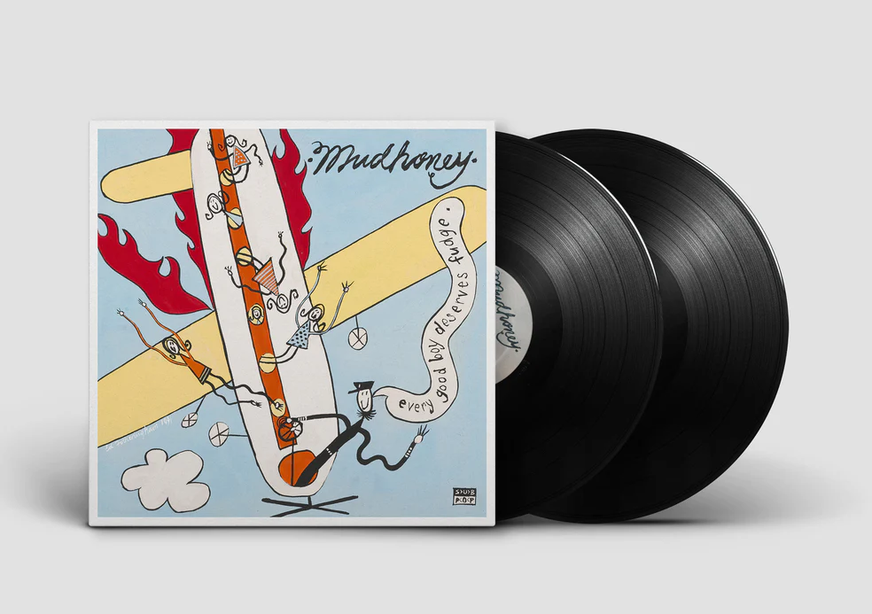

01.10.2026
## Конец недели все больше работы и меньше отдыха


# Андрей Скородумов: феномен красоты без украшательства — между академизмом и эмбиентом

В современном художественном поле редко встречаются фигуры, способные охватить столь широкий спектр практик — от классического живописного академизма до экспериментов с электронной музыкой. Андрей Владимирович Скородумов (род. 1977) представляет собой редкий пример такого универсального художника. Его творчество не вписывается в привычные каноны ни одного из существующих арт-сообществ, что и определяет его особую позицию на пересечении традиций русского искусства и современной электронной культуры.

Центральным понятием в понимании художественной практики Скородумова является концепция «чистой красоты», лишенной декоративности и оформительского жеста. Как отмечает сам автор, феномен красоты возникает у него ниоткуда — без намерения украшать или привлекать внимание внешней формой. Это принципиально отличает его подход от большинства современных художников, чьи работы часто функционируют как визуальные манифесты или концептуальные установки. Чувство объёма в работах Скородумова приходит из глубины — не с поверхности изображения, а изнутри восприятия пространства. Эта особенность связывает его наследие коренной традиции русского искусства, где пейзаж никогда не был просто фоном, но всегда носил онтологическую нагрузку.

Детство и юность художника протекали в специфических условиях постсоветского пространства. Рождённый в 1977 году на Кутузовском проспекте, Скородумов вырос в семье, где культурные влияния были разнородны: бабушка работала библиотекарем Московского авиационного института и читала книги о Рерихе, Блаватской, культуре России и Индии. Эти интеллектуальные импульсы сформировали базу для последующего художественного поиска. 1984 год стал переломным: переезд в Строгино, знакомство с пустыми улицами нового спального района, катания на коньках по площадям и санки в песчаном карьере — всё это стало частью визуальной памяти, которая позже трансформировалась в живопись.

Период 1990-х годов для московских художников стал насыщенным временем творческой жизни. Клубы «Дом», «Оги» на Китай-городе и Чистых прудах служили центрами художественной среды, где пересекались музыканты, поэты и живописцы. Скородумов не остался в стороне от этого процесса — именно в эти годы он познакомился с ключевыми фигурами своего окружения: художниками Теодором Тэжиком, Пашей Филипенко, Митей Бруни, Кириллом Шокиным и Владиславом Микошей. Особое место в биографии занимает встреча с музыкой Aphex Twin — Ричард Ди Джеймс стал для Скородумова не просто исполнителем, но философским ориентиром. Даже сам Aphex Twin был замечен в Москве в тот период, что подчёркивает уникальность художественного ландшафта конца 1980-х — начала 1990-х годов [[Aphex Twin - Wikipedia](https://en.wikipedia.org/wiki/Aphex_Twin)].

Творческий метод Скородумова строится на принципе «копирования как наркотика». Это не подражание в бытовом смысле, а глубокая практика погружения в работу старых мастеров — Рембрандта, Тициана и других. Через копирование художник учится понимать механизмы работы цвета, света, композиции. При этом Скородумов не застыл в прошлом. Его серия работ в жанре современного импрессионизма («Городской пейзаж» 2019 года, «Пляж» 2018 года) демонстрирует способность передавать не просто визуальную информацию, но атмосферу момента — тот самый свет, который падает именно так, как в памяти. Важно отметить: живопись 90-х была экспериментальной по определению. Отсутствие интернета заставляло художников идти своим путём, развиваться через общение с окружающим миром и живую практику, а не через потребление чужих образов из цифровой среды [[Академия коммунального хозяйства - Wikipedia](https://ru.wikipedia.org/wiki/Московская_академия_коммунального_хозяйства)].

В 2025 году на платформе Discogs появился релиз проекта andgopink под названием «Selected Ambient Works 85–92» — полностью повторяющий название дебютного альбома Aphex Twin. Согласно каталожным данным, все четырнадцать треков этой работы принадлежат перу Андрея Скородумова (Skorodumov Andrey). Этот релиз можно интерпретировать как несколько взаимосвязанных художественных стратегий: трибьют и авторская интерпретация — Скородумов предлагает собственное прочтение знаковых эмбиент-композиций, переводя визуальный опыт живописи в звуковую форму. Альбомы «Lunar Gravity» и «Space Tourists», ранее созданные художником, демонстрируют тяготение к космической и атмосферной электронике — жанру, где звук становится пространством, а не просто фоном [[Discogs: Andgopink](https://www.discogs.com/release/34798658)]. Концептуальный жест — выпуск альбома с таким названием может быть осознанным высказыванием о влиянии эмбиент-музыки начала 90-х на собственное творчество. Это акт присвоения культурного кода, превращение чужого бренда в инструмент выражения собственного голоса. Историческая преемственность — релиз становится мостом между живописным академизмом Скородумова и историей электронной музыки. Он помещает художника не только в контекст русского искусства, но и в глобальную историю эмбиента — от Брайана Ино до Ричарда Ди Джеймса [[Discogs: Aphex Twin](https://www.discogs.com/release/239076-Aphex-Twin-Selected-Ambient-Works-85-92)].

На момент публикации релиза на Discogs уже 12 пользователей имели его в коллекциях, ещё 95 человек добавили в «хотелку», а средний рейтинг составил 5 из 5 на основе трёх оценок. Для малоизвестного цифрового издания это исключительно высокий показатель, указывающий на признание работы среди подготовленных слушателей — фанатов эмбиента и коллекционеров.

Поездки в Европу стали важным этапом творческого пути художника. Поездка 2000 года от Белорусского вокзала до Будапешта, оттуда в Егер (Словакия), Братиславу и Прагу — это не просто туризм, а погружение в культурную традицию Центральной Европы, где художественные практики развивались иначе, чем в Москве или Лондоне [[Будапешт - Wikipedia](https://ru.wikipedia.org/wiki/Будапешт)]. В 2002 году визит в Англию — Лондон и Брайтон — позволил познакомиться с мастерской художника Брайана Коллиера. Эта встреча стала продолжением диалога между поколениями: Скородумов не просто смотрел на работы предшественников, но и общался с живыми мастерами. Прогулки по Саусхэмптону и Лондону — это процесс накопления визуального опыта, который позже трансформируется в живопись [[Брайтон - Wikipedia](https://en.wikipedia.org/wiki/Brighton)].

Биография Скородумова содержит элементы эпатажа, которые не следует игнорировать при анализе его творчества. В автобиографическом рассказе «Гранж» описывается история кражи гитары в 1993 году — когда он был около шестнадцати лет и участвовал в местной гранж-группе Dead Deskmate («Мёртвый сосед по парте»). Вокалист Гоша Блюхер писал тексты про одиночество, а Килвик, мечтавший играть как Слэш из Guns N' Roses, взял гитару ESP и унёс её из магазина «Ноты» на Кузнецком мосту. Сейчас такие истории за художником не водятся — но дух 90-х, когда всё было возможно (и гитары лежали не слишком глубоко), остался в его работах. Это чувствуется: отчаяние, драйв и надежда на лучшее — те же качества, что проявляются и в живописи, и в музыке [[Проза.ру](https://proza.ru/2019/03/15/6847)].

Почему же мы проводим параллель с Aphex Twin? Потому что Скородумов делает ровно то же самое, только в области изобразительного искусства. Он не лезет в попсу, не гонится за хайпом. Он копирует старых мастеров, потому что ему это кайфово. Он едет в Будапешт на поезде с одной сумкой и тушёнкой от бабушки. Он вспоминает, как воровал гитару в 90-х, и пишет об этом так, что читаешь и слышишь запах весеннего Строгино. Это человек, который не вписывается ни в один шаблон. Для кого-то его работы — «скучная мазня», для кого-то — «окно в вечность». Как и в случае с Aphex Twin, тут нет середины: либо ты убегаешь с выставки, либо стоишь у картины час и не можешь оторваться [[Aphex Twin - Selected Ambient Works](https://www.discogs.com/release/239076-Aphex-Twin-Selected-Ambient-Works-85-92)].

Гении вообще редко бывают удобными. Они точат гайки в Академии наук, чтобы увидеть Венецию. Они подкладывают наждачную бумагу под иглу проигрывателя. Они пишут «Доширак» в художественном тексте. И, знаете, это прекрасно [[Академия коммунального хозяйства - Wikipedia](https://ru.wikipedia.org/wiki/Московская_академия_коммунального_хозяйства)].

Искусство как способ быть человеком — Андрей Скородумов представляет собой феномен редкий и ценный — художника, для которого красота не украшательство, а онтологическая категория. Его путь от точения гаек на заводе в Академии наук до создания эмбиент-альбомов, соревнующихся с классикой электронной музыки, демонстрирует широту человеческого потенциала [[Discogs: Andgopink](https://www.discogs.com/release/34798658)]. В эпоху цифровых копий и алгоритмического искусства, когда AI генерирует картины быстрее, чем человек может их воспринять, Скородумов остаётся верным традиции живого творчества — где ошибка возможна, где время имеет значение, где опыт превращается в форму. Его работы напоминают нам о том, что искусство — это не просто продукт потребления, а способ быть человеком: чувствовать объём из глубины, слышать музыку в тишине, видеть красоту там, где других нет её [[Discogs: Andgopink](https://www.discogs.com/release/34798658)].

Если ваша бабушка после прочтения этой статьи всё ещё считает Скородумова «мракобесием», включите ей эмбиент на его канале и покажите работы из Русского музея для контраста. Скажите, что это один человек, но искусство — оно такое: если в душу запало, значит, не зря старался. А если нет — ну, C'est la vie [[Discogs: Andgopink](https://www.discogs.com/release/34798658)].


17.04.2026
## Конец недели бьюсь головой об стол от усталости и слушаю тинейджерские Mudhoney




Смотрю dave grohl Sonic Highways и думаю,  вот блять у ребят жизнь интересная хотя столько друзей потерять, 
но смотреть интересно особенно это видео про Sub-pop когда продюссер рассказывает про период с 1991-93 годы.
И вот у меня первая мыль -блах я же помню это все отлично, все эти сумашедшие годы, все своих знакомых из которых половины уже нет в живых
и я подумал я буду писать про Epelepsy bout и Dead deskmate.


вот какие-то части буду наверное выкладывать сюда.
но сначала секцию с CWA  мне все-таки удалось его развернуть, Casa os немного полуачается на стеройдах  CWA

бла. Как хорошо што я не слышал mudhoney тогда оставлю его здесь:

'''services:
  calibre-web-automated:
    # Официальный образ проекта [citation:5][citation:6]
    image: crocodilestick/calibre-web-automated:latest
    container_name: calibre-web-automated
    
    environment:
      # ID пользователя и группы для прав доступа к файлам
      # Узнайте свои ID через команду 'id' в терминале
      - PUID=1000
      - PGID=1000
      # Ваш часовой пояс (пример для Москвы)
      - TZ=Europe/Moscow
      # Опционально: автоматически конвертировать книги в EPUB
      - CWA_AUTOCONVERT=true
    
    volumes:
      # Папка с настройками (логи, база данных пользователей)
      - ./config:/config
      # Папка для автоматического импорта (файлы УДАЛЯЮТСЯ после обработки!)
      - ./ingest:/cwa-book-ingest
      # Папка с вашей Calibre библиотекой (где лежит metadata.db)
      - ./library:/calibre-library
    
    ports:
      # Левый порт можно менять, правый - нет
      - "8083:8083"
    
    restart: unless-stopped 
'''
- [x] Сделано на сегодня
- [ ] а завтра?

* [завтра разварачиваю obsidian]
* 2026-04-17


### Добро пожаловать на мой сайт.
23.12.2025.
Скоро уже рождество, но как-то внезапно у меня упал runtipi и пока победить у меня его не получилось,
надо заниматься - времени нет. недосып как обычно 2-3 часа. ездил в гранд-юг, много мебели красивой
и люстра, хочется диван купить и кровать, но нехватает на мебель около 300тыс.

19.12.2025. немного лучше сегодня, потомушто спать лег наверно в22. но вставать все равно в 6.30
решил попытаться и печатать на бумаге. посмотрим. хотелось бы увидеть оригинал. 
- [JamieHewlett.com](https://JamieHewlett.com)

- ✨Magic ✨


18.12.2005.  Сижу уставший и не выспавшийся на работе встал в 6.30 на улице холодно, надо сделать 35листов А3
 Деньги кончились почти. зато можно сьесть печеньку с кофе.
вот такой канун рождества 2025. 

залил себе кодик на гити чаёк попивай  - протестировал, работает
import java.time.Duration;
import java.time.LocalTime;

public class SimpleConsoleTimer {
    public static void main(String[] args) throws InterruptedException {
        LocalTime targetTime = LocalTime.of(18, 0, 0);
        
        System.out.println("=== ТАЙМЕР ДО 18:00 (электронные часы) ===\n");
        
        while (true) {
            LocalTime currentTime = LocalTime.now();
            
            if (currentTime.isBefore(targetTime)) {
                Duration duration = Duration.between(currentTime, targetTime);
                long hours = duration.toHours();
                long minutes = duration.toMinutesPart();
                long seconds = duration.toSecondsPart();
                
                // Используем ANSI цвета для зеленой подсветки
                String green = "\u001B[32m";
                String brightGreen = "\u001B[92m";
                String reset = "\u001B[0m";
                
                // Эффект мигания
                if (System.currentTimeMillis() % 1000 < 500) {
                    System.out.print(green + "═══════════════════════════════\n");
                    System.out.print("  ╔═══════════════════════╗\n");
                    System.out.print("  ║     " + 
                        String.format("%02d:%02d:%02d", hours, minutes, seconds) + 
                        "     ║\n");
                    System.out.print("  ╚═══════════════════════╝\n");
                    System.out.print("═══════════════════════════════\n" + reset);
                } else {
                    System.out.print(brightGreen + "═══════════════════════════════\n");
                    System.out.print("  ╔═══════════════════════╗\n");
                    System.out.print("  ║     " + 
                        String.format("%02d:%02d:%02d", hours, minutes, seconds) + 
                        "     ║\n");
                    System.out.print("  ╚═══════════════════════╝\n");
                    System.out.print("═══════════════════════════════\n" + reset);
                }
                
            } else {
                String red = "\u001B[31m";
                String reset = "\u001B[0m";
                
                System.out.print(red + "═══════════════════════════════\n");
                System.out.print("  ╔═══════════════════════╗\n");
                System.out.print("  ║     18:00:00         ║\n");
                System.out.print("  ║   ВРЕМЯ ВЫШЛО!       ║\n");
                System.out.print("  ╚═══════════════════════╝\n");
                System.out.print("═══════════════════════════════\n" + reset);
            }
            
            // Пауза и очистка
            Thread.sleep(1000);
            clearConsole();
        }
    }
    
    private static void clearConsole() {
        try {
            if (System.getProperty("os.name").contains("Windows")) {
                new ProcessBuilder("cmd", "/c", "cls").inheritIO().start().waitFor();
            } else {
                System.out.print("\033[H\033[2J");
                System.out.flush();
            }
        } catch (Exception e) {
            // Если не получилось очистить - просто выводим пустые строки
            for (int i = 0; i < 10; i++) {
                System.out.println();
            }
        }
    }
}


[](https://github.com/clente/hugo-bearcub/actions/workflows/gh-pages.yml)
[](https://github.com/clente/hugo-bearcub/blob/main/LICENSE)


# ᕦʕ •ᴥ•ʔᕤ Duck Club

[](https://github.com/clente/hugo-bearcub/actions/workflows/gh-pages.yml)
[](https://github.com/clente/hugo-bearcub/blob/main/LICENSE)

## Overview

 A lightweight [Hugo](https://gohugo.io/) theme based on [Bear
Blog](https://bearblog.dev) and [Hugo Bear
Blog](https://github.com/janraasch/hugo-bearblog).

**Bear Cub** takes care of speed and optimization, so you can focus on writing
good content. It is free, multilingual, optimized for search engines,
no-nonsense, responsive, light, and fast. Really fast.

## Installation

Follow Hugo's [quick start](https://gohugo.io/getting-started/quick-start/) to
create an empty website and then clone **Bear Cub** into the themes directory as
a [Git submodule](https://git-scm.com/book/en/v2/Git-Tools-Submodules):

```sh
git submodule add https://github.com/clente/hugo-bearcub themes/hugo-bearcub
```

To finish off, append a line to the site configuration file:

```sh
echo 'theme = "hugo-bearcub"' >> hugo.toml
```

## Features

Like [Bear Blog](https://bearblog.dev), this theme:
- Is free and open source
- Looks great on any device
- Makes tiny (~5kb), optimized, and awesome pages
- Has no trackers, ads, or scripts
- Automatically generates an RSS feed

But that's not all! **Bear Cub** is also...

### Accessible

**Bear Cub** has a few accessibility upgrades when compared to its predecessors.
The color palette has been overhauled to make sure everything is
[readable](https://web.dev/color-and-contrast-accessibility/) for users with low
vision impairments or color deficiencies, and some interactive elements were
made bigger to facilitate [clicking](https://web.dev/accessible-tap-targets/)
for users with a motor impairment.

These small changes mean that **Bear Cub** passes Google's [PageSpeed
test](https://pagespeed.web.dev/report?url=https%3A%2F%2Fclente.github.io%2Fhugo-bearcub%2F)
with flying colors.


### Secure

[**Bear Cub**'s demo](https://clente.github.io/hugo-bearcub/) is hosted on GitHub
and therefore I'm not in control of its [Content Security
Policy](https://infosec.mozilla.org/guidelines/web_security#content-security-policy).
However, the theme itself was made with security in mind: there are no inline
styles and it uses no JavaScript at all.

If you want to improve your [Mozilla
Observatory](https://observatory.mozilla.org/) score even further, you should be
able to simply add a few headers to your hosting service's configuration (e.g.
[Netlify](https://docs.netlify.com/routing/headers/) or [Cloudflare
Pages](https://developers.cloudflare.com/pages/platform/headers/)) and never
have to think about it again. My `_headers` file, for example, looks like this:

```
/*
  X-Content-Type-Options: nosniff
  Strict-Transport-Security: "max-age=31536000; includeSubDomains; preload" env=HTTPS
  Cache-Control: max-age=31536000, public
  X-Frame-Options: deny
  Referrer-Policy: no-referrer
  Feature-Policy: microphone 'none'; payment 'none'; geolocation 'none'; midi 'none'; sync-xhr 'none'; camera 'none'; magnetometer 'none'; gyroscope 'none'
  Content-Security-Policy: default-src 'none'; manifest-src 'self'; font-src 'self'; img-src 'self'; style-src 'self'; form-action 'none'; frame-ancestors 'none'; base-uri 'none'
  X-XSS-Protection: 1; mode=block
```

### Multilingual

If you need to write a blog that supports more than one language, **Bear Cub**
has you covered! Check out the demo's [`hugo.toml`
file](https://github.com/clente/hugo-bearcub/blob/main/exampleSite/hugo.toml)
for a sample of how you can setup multilingual support.

By default, the theme creates a translation button that gets disabled when the
current page is only available in any other language. You can also choose to
hide this button (instead of disabling it) by setting `hideUntranslated =
true`.

### More

Every once in a while, as I keep using **Bear Cub**, I notice that there is some
functionality missing. Currently, these are the "advanced features" that I have
already implemented:

- Full-text RSS feed: an enhanced RSS feed template that includes the (properly
  encoded) full content of your posts in the feed itself.
- Static content: you can create empty blog entries that act as links to static
  files by including `link: "{url}"` in a post's [front
  matter](https://gohugo.io/content-management/front-matter/). You can also add
  `render: false` to your [build
  options](https://gohugo.io/content-management/build-options/#readout) to avoid
  rendering blank posts.
- Skip link: a "skip to main content" link that is temporarily invisible, but
  can be focused by people who need a keyboard to navigate the web (see [PR
  #5](https://github.com/clente/hugo-bearcub/pull/5) by
  [@2kool4idkwhat](https://github.com/2kool4idkwhat) for more information).
- Reply by email: if you supply an email address, the theme creates a "Reply to
  this post by email" button at the end of every post (see Kev Quirk's [original
  implementation](https://kevquirk.com/adding-the-post-title-to-my-reply-by-email-button)).
  This button can be suppressed on a case-by-case by setting `hideReply: true`
  in a post's [front matter](https://gohugo.io/content-management/front-matter/)
  (see [PR #18](https://github.com/clente/hugo-bearcub/pull/18) by
  [@chrsmutti](https://github.com/chrsmutti)).
- `absfigure` shortcode: a shortcut to use the `figure` shortcode that also
  converts relative URLs into absolute URLs by using the `absURL` function.
- Single-use CSS (EXPERIMENTAL): you can add some styles to a single page by
  writing the CSS you need in `assets/{custom_css}.css` and then including
  `style: "{custom_css}.css"` in the [front
  matter](https://gohugo.io/content-management/front-matter/) of said page.
- Conditional CSS (EXPERIMENTAL): since **Bear Cub** does syntax highlighting
  without inline styles (see `hugo.toml` for more information), it only load its
  `syntax.css` if, and only if, a code block is actually present in the current
  page.
- Alternative "Herman" style (EXPERIMENTAL): if you want to check out a more
  modern CSS style, you can change the `themeStyle` parameter to `"herman"` in
  order to activate [Herman Martinus's](https://herman.bearblog.dev/) version of
  the [Blogster Minimal](https://blogster-minimal.netlify.app/) theme for
  [Astro](https://astro.build/).
- Dynamic social card generation (EXPERIMENTAL): if you don't add preview images
  to a post, this template will generate one based on the title. You can see an
  example below.


## Configuration

**Bear Cub** can be customized with a `hugo.toml` file. Check out the
[configuration](https://github.com/clente/hugo-bearcub/blob/main/exampleSite/hugo.toml)
of the [demo](https://clente.github.io/hugo-bearcub/) for more information.

```toml
# Basic config
baseURL = "https://example.com"
theme = "hugo-bearcub"
copyright = "John Doe (CC BY 4.0)"
defaultContentLanguage = "en"

# Generate a nice robots.txt for SEO
enableRobotsTXT = true

# Setup syntax highlighting without inline styles. For more information about
# why you'd want to avoid inline styles, see
# https://developer.mozilla.org/en-US/docs/Web/HTTP/Headers/Content-Security-Policy/style-src#unsafe_inline_styles
[markup]
  [markup.highlight]
    lineNos = true
    lineNumbersInTable = false
    # This allows Bear Cub to use a variation of Dracula that is more accessible
    # to people with poor eyesight. For more information about color contrast
    # and accessibility, see https://web.dev/color-and-contrast-accessibility/
    noClasses = false

# Multilingual mode config. More for information about how to setup translation,
# see https://gohugo.io/content-management/multilingual/
[languages]
  [languages.en]
    title = "Bear Cub"
    languageName = "en-US 🇺🇸"
    LanguageCode = "en-US"
    contentDir = "content"
    [languages.en.params]
      madeWith = "Made with [Bear Cub](https://github.com/clente/hugo-bearcub)"
  [languages.pt]
    title = "Bear Cub"
    languageName = "pt-BR 🇧🇷"
    LanguageCode = "pt-BR"
    contentDir = "content.pt"
    [languages.pt.params]
      madeWith = "Feito com [Bear Cub](https://github.com/clente/hugo-bearcub)"

[params]
  # The description of your website
  description = "Bear Cub Demo"

  # The path to your favicon
  favicon = "images/favicon.png"

  # These images will show up when services want to generate a preview of a link
  # to your site. Ignored if `generateSocialCard = true`. For more information
  # about previews, see https://gohugo.io/templates/internal#twitter-cards and
  # https://gohugo.io/templates/internal#open-graph
  images = ["images/share.webp"]

  # This title is used as the site_name on the Hugo's internal opengraph
  # structured data template
  title = "Bear Cub"

  # Dates are displayed following the format below. For more information about
  # formatting, see https://gohugo.io/functions/format/
  dateFormat = "2006-01-02"

  # If your blog is multilingual but you haven't translated a page, this theme
  # will create a disabled link. By setting `hideUntranslated` to true, you can
  # have the theme simply not show any link
  hideUntranslated = false

  # (EXPERIMENTAL) This theme has two options for its CSS styles: "original" and
  # "herman". The former is what you see on Bear Cub's demo (an optimized
  # version of Hugo Bear Blog), while the latter has a more modern look based on
  # Herman Martinus's version of the Blogster Minimal theme for Astro.
  themeStyle = "original"

  # (EXPERIMENTAL) This theme is capable of dynamically generating social cards
  # for posts that don't have `images` defined in their front matter; By setting
  # `generateSocialCard` to false, you can prevent this behavior. For more
  # information see layouts/partials/social_card.html
  generateSocialCard = true

  # Social media. Delete any item you aren't using to make sure it won't show up
  # in your website's metadata.
  [params.social]
    twitter = "example" # Twitter handle (without '@')
    facebook_admin = "0000000000" # Facebook Page Admin ID

  # Author metadata. This is mostly used for the RSS feed of your site, but the
  # email is also added to the footer of each post. You can hide the "reply to"
  # link by using a `hideReply` param in front matter.
  [params.author]
    name = "John Doe" # Your name as shown in the RSS feed metadata
    email = "me@example.com" # Added to the footer so readers can reply to posts
```

## Contributing

If you come across any problems while using **Bear Cub**, you can file an
[issue](https://github.com/clente/hugo-bearcub/issues) or create a [pull
request](https://github.com/clente/hugo-bearcub/pulls).
